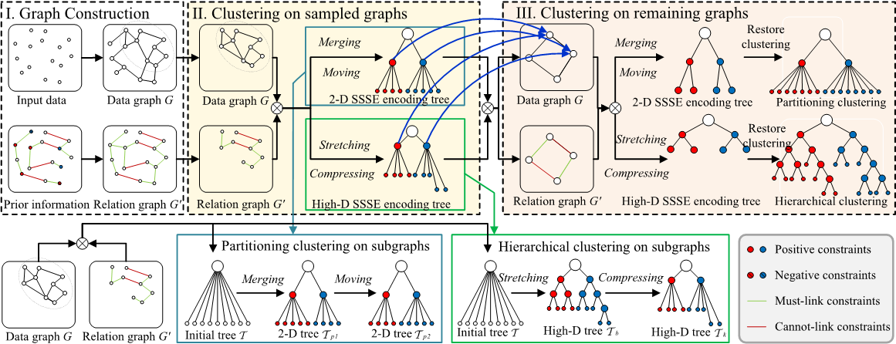

# SSSE
### Scalable Semi-supervised clustering via structural entropy with different constraints.

The SSSE framework. We illustrate SSSE on a small dataset. 
(I) Two graphs G and G′ are constructed from input data and prior information in the formats of pairwise constraints and label constraints, respectively. 
(II) Semi-supervised clustering is performed on the sampled graphs. 
(III) Semi-supervised clustering is performed on the remaining graphs, in which obtained clusters are taken as new data points. 
For semi-supervised partitioning clustering, clustering in (II) and (III) is achieved by two operators merging and moving, while for semi-supervised hierarchical clustering, clustering is achieved by stretching and compressing.

# Installation
Install the required packages listed in the file ```requirement.txt```. The code is tested on Python 3.10.0.

Datasets used are in the ```data``` branch.

# Usage
In the root directory of this project:
```
python main.py [-h][--method METHOD][--dataset DATASET]
               [--constraint_ratio RATIO][--constraint_weight WEIGHT]
               [--sigmasq SIGMASQ][--exp_repeats REPEATS]
               [--knn_constant KNN_CONSTANT][--hie_knn_k HIE_KNN_K]
               [--sampling SAMPLING][--sampling_size SAMPLING_SIZE]
```

example: ```python main.py --method SSSE_partitioning_pairwise --dataset Yale --constraint_ratio 0.2```
```
required arguments:
  --method METHOD    running different components of SSE. Choices are SSSE_partitioning_pairwise, SSSE_partitioning_bio, and so on.
  --dataset DATASET    dataset to run. They should be stored in directory ./datasets.
  --constraint_ratio   constraint ratio. Recommend setting 0.2 for pairwise constraints and 0.1 for label constraints.
```
```
optional arguments:
  --constraint_weight     weight for penalty term. (default 1).
  --sigmasq SIGMASQ       square of Gaussian kernel band width, i.e., sigma^2.
  --exp_repeats REPEATS   number of experiment repeats. (default 10).
  --knn_constant          a constant for graph construction in partitioning clustering. (default 20).
  --hie_knn_k             a constant for graph construction in hierarchical clustering. (default 5).
  --sampling              sampling with neighborhood-preserving graph sampling strategy (neighbor) or random sampling (random). (default neighbor).
  --sampling_size         sampling size for graph sampling-based scalability strategy. (default 1000).
```
